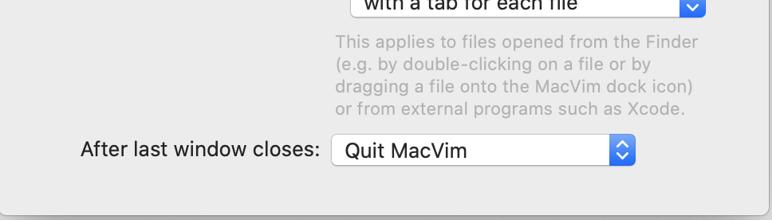
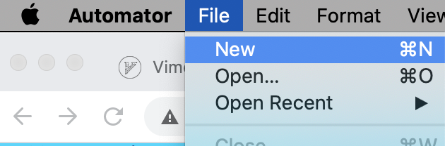
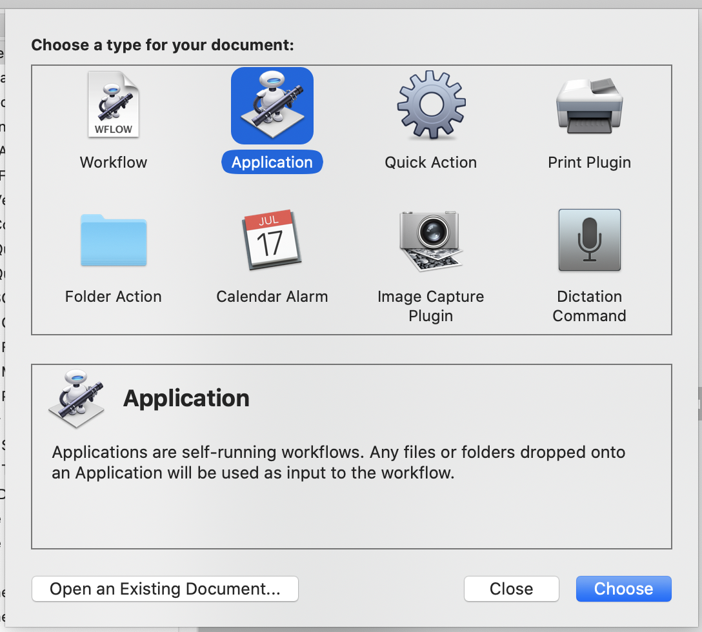
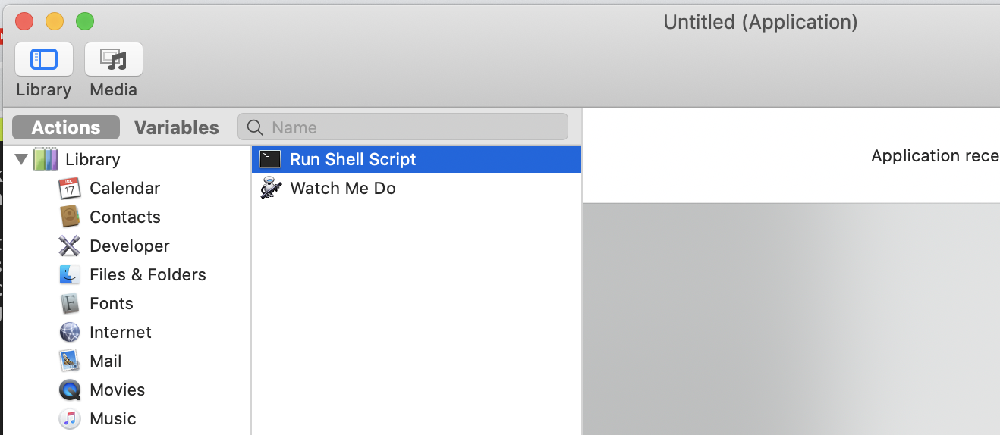
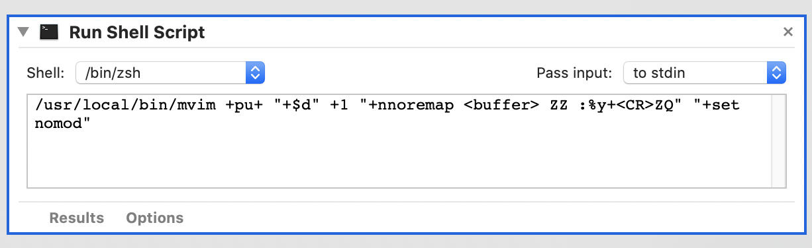
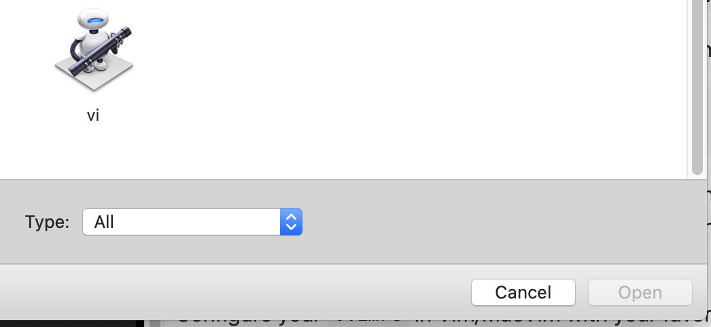

# Use vIM as your personal clipboard text editor

Truth be told I've always wanted to make vIM my personal editor, not just a simple terminal workaround to hammer out config files nor as a true IDE full of plugins and bling, *no no no*, I wanted something much simpler! I wanted that **everytime** I have text on screen, just let me do my **vIM black magic** on it! simple! or so it seemed...

Over the years I've tried a lot of alternatives, I've had a shortcut to start vim in half of the screen in a terminal for a while, used vim inside Eclipse java-based terminal ( yes really! ), used [vimium](https://vimium.github.io/) and [wasavi](http://appsweets.net/wasavi/) on my browser, had full vim keybindings configured in IntelliJ, shared my home folder or documents over ssh/ftp/svn/git and even a VBScript workaround to edit [outlook emails in vim!!!](https://www.vim.org/scripts/script.php?script_id=3087)

Crazy crazy stuff I know, but I was desperate, here I have all the power in my hands and now I can't integrate it normally in my daily workflow, from time to time I had to use some kind of external GUI text editor bloated or worse, using VSCode with its broken vim javascript plugin running on a monster **600MB** instance of ... text 😞 uurgh!

When I arrive home sudently everything is different, all my workflow is integrated, my ```.vimrc``` is global to all my machines and even the applications try to use vim as my default text editor, in my world everything works and *vIM is king!* 👑 ...but recently another fallback, I had to switch to my company MacBook Pro  and suddently everything is chaos again, different keyboard and keybinds, different applications, different shell... I had to start from scratch, battle my way onto the perfect integration again!


## The light 

But now I've found a new solution something that will actually help me work with this

I've found a way to integrate vIM with your **clipboard** in a seemless way and letting you change everything you see for all that is needed using your best keystrokes.

The trick is that since all applications know how to talk to the MacOS clipboard, If I use vIM to change whatever is in there I'll be able to edit.. *anything!!*

Seeing that we are using a Mac we needed to have something like a GUI to run this, we could run it inside *iTerm2* but I found that the integration itself is not great, I've experienced some crashes with large buffers or weird plugins and the iTerm2 keybinds can affect the way that you choose your leader keys, also for some reason I didn't find a simple way to configure it to start vim with a custom profile without tinkering with it for a long time.


## Enter MacVim

So what the hell is **[MacVim](https://github.com/macvim-dev/macvim)** ??

Well it's vim.. for mac! It's as simple as that, you can install and it will run vim mostly in the way that you use the normal one but inside it's own window.

Assuming you have brew it's simple enough to install, just go to your terminal and type the following:


````
brew install macvim --with-override-system-vim
brew linkapps
````

This will override your current vim installation and now you just have to link the binary itself:

Edit your shell startup files to ensure that ```/usr/local/bin``` comes first in your ```$PATH```.

If you use vim as ```$VISUAL``` or ```$EDITOR```, add ```export VISUAL='mvim -f'``` to your environment (details).

Check that you installed everything correctly by running
````
brew doctor
````

Now, you can run the graphical MacVim on a file by running ```mvim foo.txt``` from the command-line. Or, you can run the text-based editor by running ```vim foo.txt```. Also, if other programs (e.g., git) fork off a separate editor, they'll run the graphical MacVim.

Configure your ```.vimrc``` in Vim/MacVim with your favorite plugins and defaults and test it by calling it from the command line to make sure it is by your liking.

**important:** you also have to go into MacVim options and toggle the ```After last window exit: Quit vim```



This will be important further on...

## The black magic stuff

Now this is what we do best, so now it's just a matter of... well... starting it with ... stuff. 

OK let's go try this first, we need a way to script something... in MacOS that means **Automator** 🤖

Open automator and start by creating a new script:



Choose "Application" from the following dialog:




Choose "Run Shell Script" from the actions tree:



In the action itself type the following *incantation*:

```
/usr/local/bin/mvim +pu+ "+$d" +1 "+nnoremap <buffer> ZZ :%y+<CR>ZQ" "+set nomod"
```



Save the new file on a folder that Spotlight can find like your user home folder and name it somthing you like, I've named mine just ```vi```



## It just... Works!

So now the big reveal, how does it all work? How do I cast my new spell?

The workflow now will be the following:

- Copy something you want to edit to the clipboard (Command+A Command+C)
- Launch Spotlight (Command+Space) and type "vi"
	- (Alternatively you can also trigger it using a custom keybind)
- MacVim will start with all your clipboard content
- Use your vIM mastery to edit everything as you like
- When you are done use ```ZZ``` to quit vim, if you want to ignore your edit just use ```:q!``` or ```:exit``` to exit MacVim without saving 
- All your changes are now in your clipboard, paste it wherever you want
- Done.


This is so easy and intuitive that it will become your second nature, use it for ANYTHING, edit emails, edit command line calls, edit json files, jwt tokens... the sky is the limit, **if it can be copied to your clipboard you can edit it !**

Here's a little video:


See how easy that was, this integration is everything I could have asked for, I can quickly change emails, markdown pages even chat messages with the bindings and plugins I know and love without having to deal with clumsy integrations or weird workarounds.

From the last month until now I've been using it more and more and I now actually use it a lot for debgging sessions, fetch the data from the database, filter for a keyword I want, run the output through jq and send it to someone who needs that data to run the query. easy! and best of all it allows me to finally have a seamless experience and continue to imporve my vIM skills for the future.

Hope you liked this small(ish) tutorial


\- [Magikarp-salesman](https://magikarp.sale)
